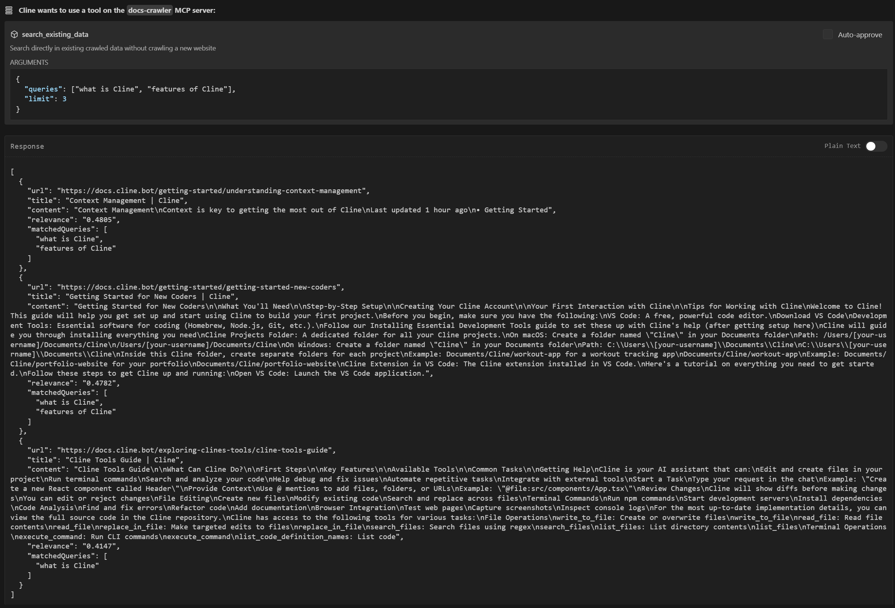

## THINGS TO KEEP IN MIND:

1. Please increase timeout for the server to crawl! use `"timeout": 300000` for example in `cline_mcp_settings.json`
2. Use an OpenAI API key for embedding. Future releases will include local embedding model

---




---

# docs-crawler-mcp MCP Server

A powerful documentation website crawler and semantic search tool that helps you efficiently extract, index, and search through documentation content.

## Features

- **Intelligent Website Crawling**: Automatically crawls documentation websites while respecting site structure and rate limits
- **Smart Content Extraction**: Focuses on meaningful documentation content while filtering out navigation and boilerplate
- **Semantic Search**: Uses vector-based search to find relevant content even with different phrasing
- **Multi-Query Search**: Supports multiple diverse queries to get comprehensive results
- **Persistent Storage**: Caches crawled content for efficient reuse and quick searches
- **Deduplication**: Intelligently combines and ranks results from multiple queries

## Setup for Cline

1. Create a new directory for your MCP server:

```bash
mkdir docs-crawler-mcp
cd docs-crawler-mcp
```

2. Initialize a new TypeScript project:

```bash
npm init -y
npm install typescript @types/node --save-dev
npx tsc --init
```

3. Install the MCP SDK and required dependencies:

```bash
npm install @modelcontextprotocol/sdk
```

4. Configure your `tsconfig.json`:

```json
{
  "compilerOptions": {
    "target": "ES2020",
    "module": "ES2020",
    "moduleResolution": "node",
    "outDir": "./build",
    "rootDir": "./src",
    "strict": true,
    "esModuleInterop": true,
    "skipLibCheck": true,
    "forceConsistentCasingInFileNames": true
  },
  "include": ["src/**/*"],
  "exclude": ["node_modules"]
}
```

5. Add build scripts to `package.json`:

```json
{
  "type": "module",
  "scripts": {
    "build": "tsc && node -e \"require('fs').chmodSync('build/index.js', '755')\"",
    "watch": "tsc -w"
  }
}
```

6. Configure the MCP server in Cline's settings:

On Windows, edit `%APPDATA%/Code/User/globalStorage/saoudrizwan.claude-dev/settings/cline_mcp_settings.json`:

```json
{
  "mcpServers": {
    "docs-crawler": {
      "command": "node",
      "args": [
        "C:/Users/yazan/Documents/Cline/MCP/docs-crawler-mcp/build/index.js"
      ],
      "env": {
        "OPENAI_API_KEY": "YOUR OPEN AI API KEY"
      },
      "timeout": 300000,
      "disabled": false,
      "autoApprove": []
    }
  }
}
```

On macOS, edit `~/Library/Application Support/Code/User/globalStorage/saoudrizwan.claude-dev/settings/cline_mcp_settings.json`:

```json
{
  "mcpServers": {
    "docs-crawler": {
      "command": "node",
      "args": ["/path/to/docs-crawler-mcp/build/index.js"],
      "disabled": false,
      "autoApprove": []
    }
  }
}
```

## Available Tools

### search_website

All-in-one tool to crawl a website and perform semantic searches:

```typescript
{
  "url": "https://docs.example.com",
  "queries": ["getting started", "configuration", "api reference"],
  "limit": 5,  // Optional: max results per query (default: 5)
  "forceCrawl": false  // Optional: force fresh crawl (default: false)
}
```

### list_crawled_websites

List all previously crawled websites with metadata:

```typescript
// No parameters required
// Returns array of:
{
  "url": "https://docs.example.com",
  "crawlDate": "2025-04-01T19:51:20.000Z",
  "pagesCount": 42
}
```

### recrawl_website

Force a fresh crawl of a previously indexed website:

```typescript
{
  "url": "https://docs.example.com"
}
```

### search_existing_data

Search through already crawled content without new crawling:

```typescript
{
  "queries": ["error handling", "authentication"],
  "url": "https://docs.example.com",  // Optional: limit to specific site
  "limit": 5  // Optional: max results (default: 5)
}
```

## Development

For development with auto-rebuild:

```bash
npm run watch
```

### Debugging

Since MCP servers communicate over stdio, debugging can be challenging. The MCP Inspector provides a web interface for monitoring server activity:

```bash
npm run inspector
```

This will provide a URL to access the debugging tools in your browser.

## Example Usage in Cline

Once the server is set up and running, you can use it in Cline like this:

1. Search a documentation website:

```
Ask Cline: "Search the React documentation for information about hooks and state management"
```

2. View previously crawled sites:

```
Ask Cline: "Show me all the documentation websites that have been crawled"
```

3. Update stale documentation:

```
Ask Cline: "Recrawl the Vue.js documentation to get the latest content"
```

4. Search existing content:

```
Ask Cline: "Find information about authentication in the previously crawled documentation"
```

## Project Structure

```
docs-crawler-mcp/
├── src/
│   ├── index.ts        # Main entry point
│   ├── server.ts       # MCP server implementation
│   ├── tools.ts        # Tool implementations
│   ├── crawler.ts      # Website crawler logic
│   ├── index-db.ts     # Search indexing
│   ├── types.ts        # TypeScript types
│   └── utils.ts        # Utility functions
├── package.json
└── tsconfig.json
```

For more information about MCP servers and Cline integration, visit the [Cline MCP documentation](https://docs.cline.bot/mcp-servers/mcp).
